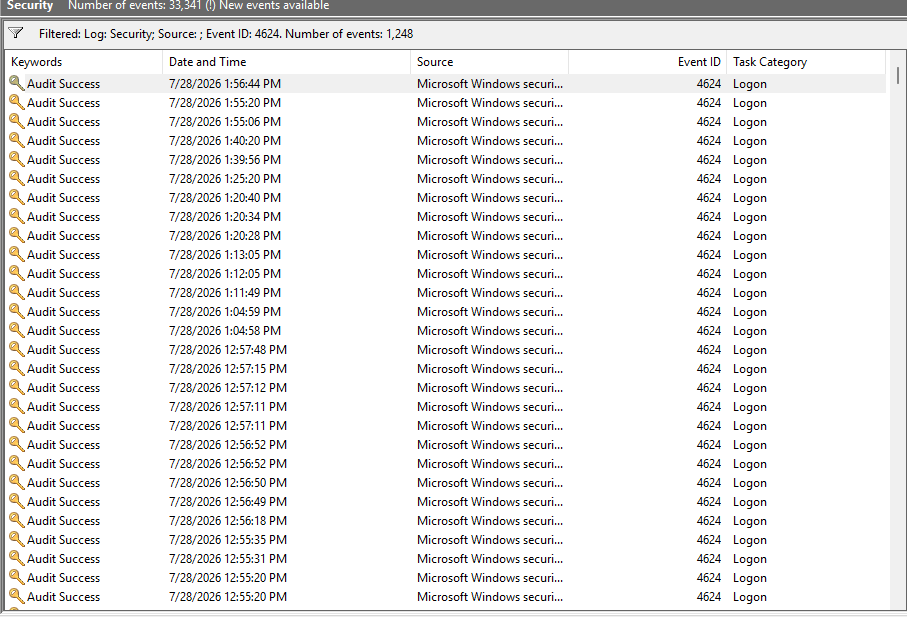
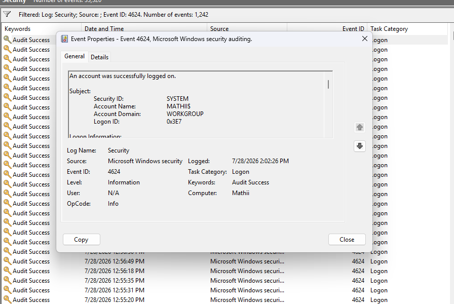
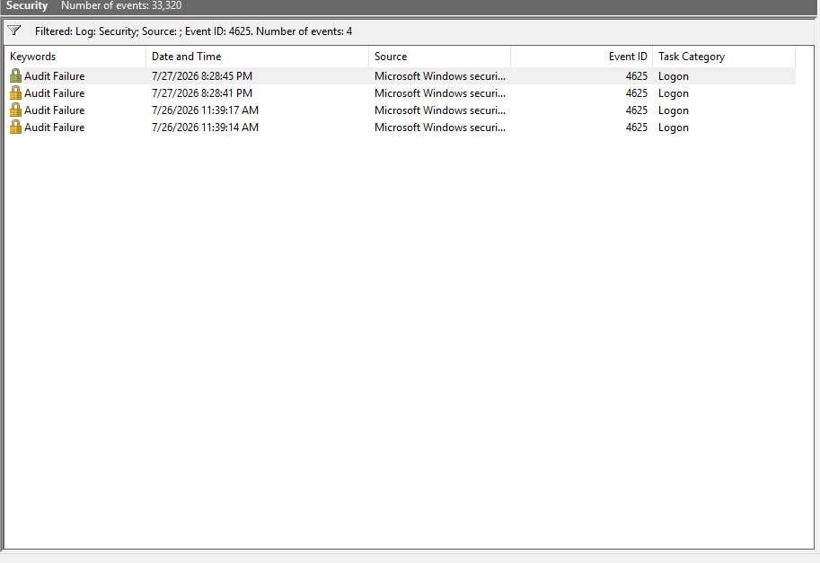
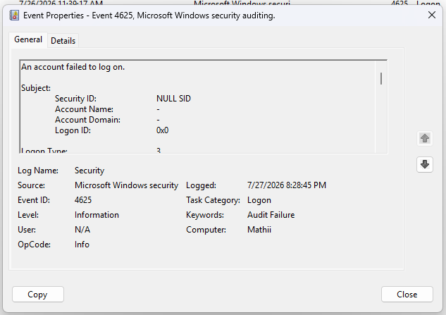
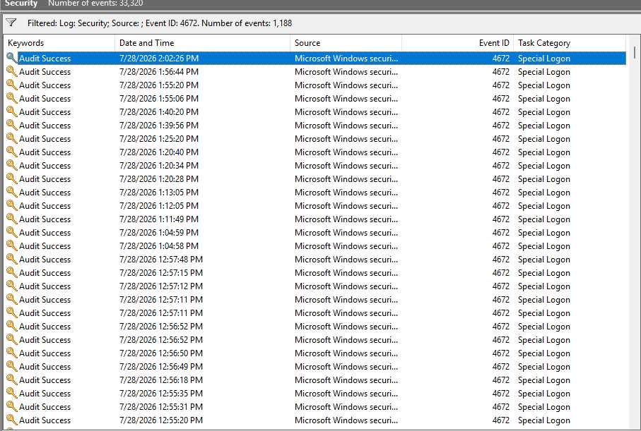
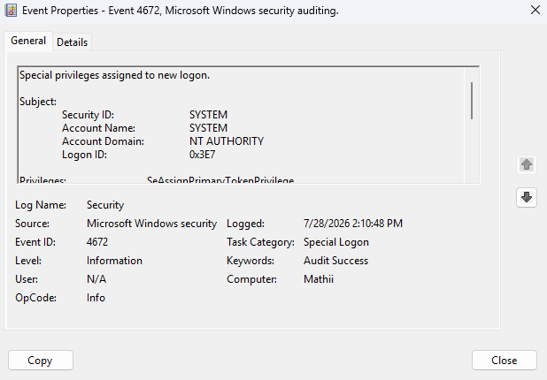
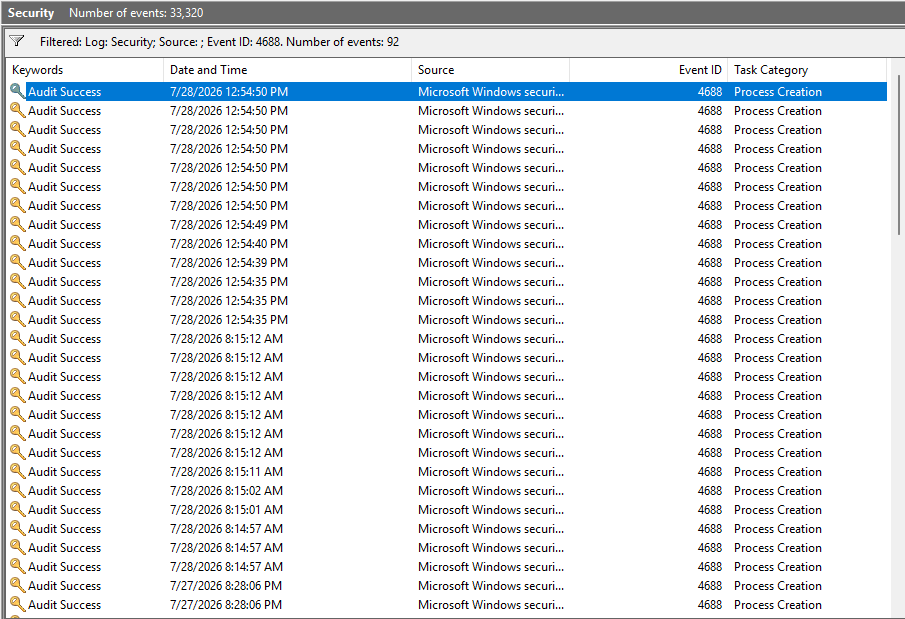
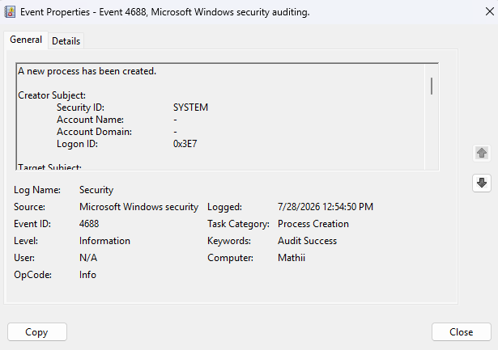
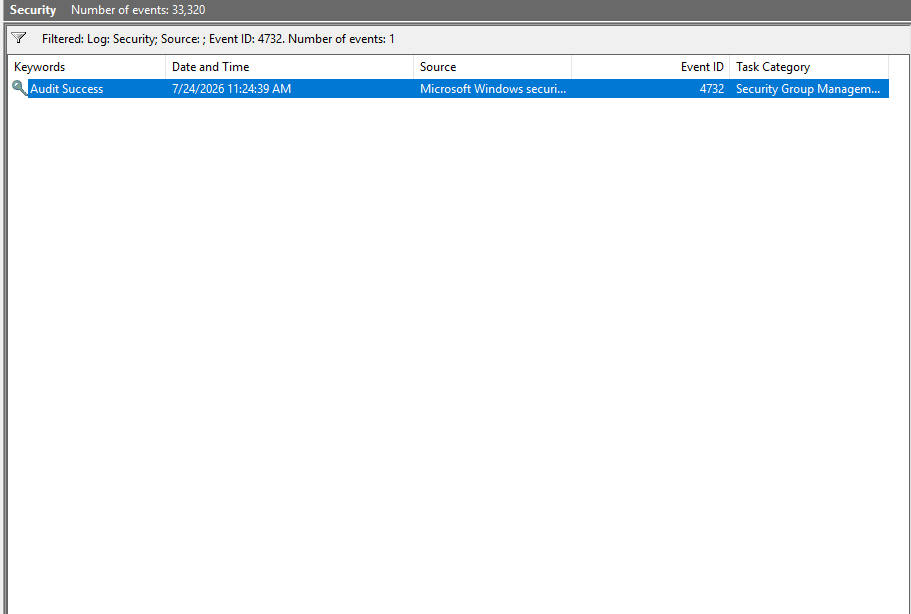

#  Windows Event Log Analysis

# Windows Event Log Analysis

##  Project Overview

This project demonstrates Windows Security Event Log analysis using Event Viewer.

The objective is to understand how SOC Analysts investigate authentication events, privilege escalation, and process creation activities using Windows Security Logs.

---

##  Objectives

- Analyze Windows Security Logs
- Identify important Security Event IDs
- Understand authentication events
- Investigate failed logon attempts
- Monitor privileged logons
- Analyze process creation events
- Practice basic incident investigation

---

##  Lab Environment

- Windows 11
- Event Viewer
- Windows Security Logs
- GitHub

---

##  Event IDs Covered

| Event ID | Description |
|----------|-------------|
|4624|Successful Logon|
|4625|Failed Logon|
|4672|Special Privileges Assigned|
|4688|Process Creation|
|4732|User Added to Local Security Group|

---

#  Event ID 4624 – Successful Logon

### Description

Generated whenever a user successfully authenticates to Windows.

### SOC Use Case

- Verify legitimate user logins
- Detect unusual login times
- Identify lateral movement
- Investigate suspicious logins

---

#  Event ID 4625 – Failed Logon

### Description

Generated whenever a login attempt fails.

### SOC Use Case

- Detect brute-force attacks
- Identify password spraying
- Monitor unauthorized access attempts

---

#  Event ID 4672 – Special Logon

### Description

Generated when privileged accounts receive administrator-level privileges.

### SOC Use Case

- Detect privileged account usage
- Investigate privilege escalation
- Monitor administrator activity

---

#  Event ID 4688 – Process Creation

### Description

Generated whenever a new process starts.

### SOC Use Case

- Malware detection
- PowerShell monitoring
- Command execution monitoring
- Threat hunting

---

#  Event ID 4732 – User Added to Local Group

### Description

Generated when a user is added to a local security-enabled group.

### SOC Use Case

- Detect privilege escalation
- Monitor administrative group changes
- Identify unauthorized account modifications

---

##  Skills Demonstrated

- Windows Event Viewer
- Windows Security Logs
- Log Analysis
- Event ID Investigation
- Authentication Monitoring
- Incident Investigation
- Windows Security
- Basic Threat Hunting

---

##  References

- Microsoft Event Documentation
- MITRE ATT&CK Framework
